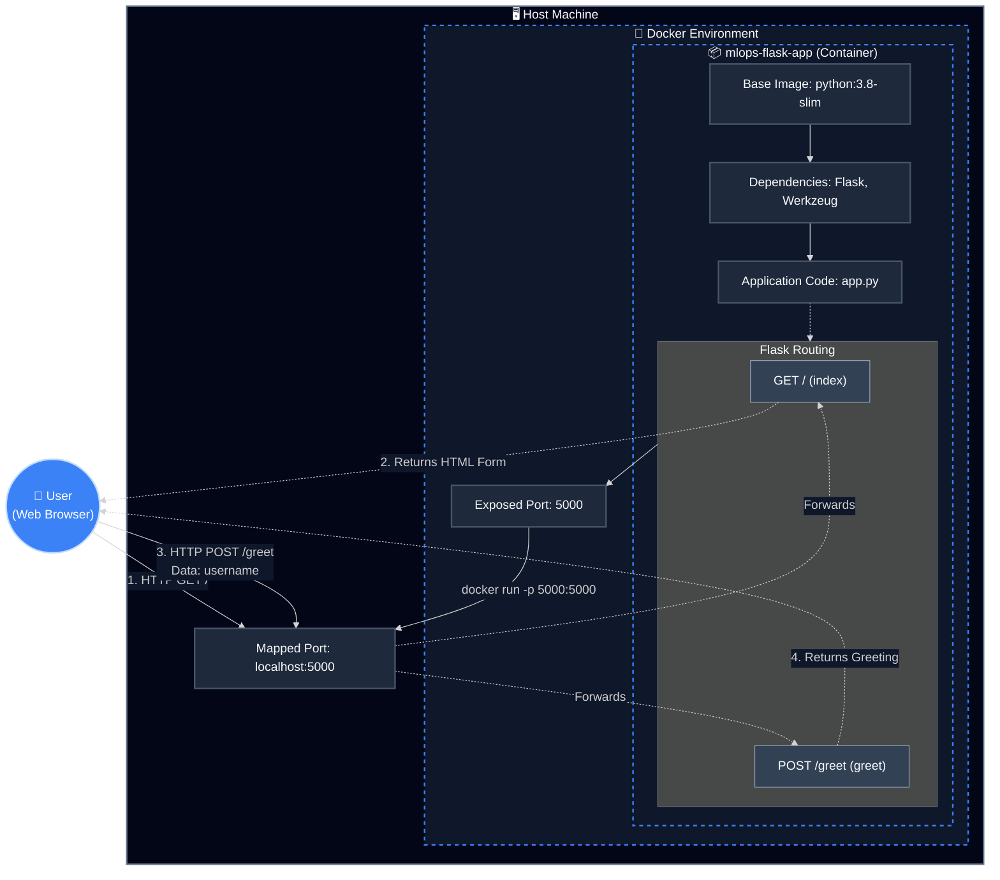

# MLOps Docker Implementation 🐳


Welcome to the **MLOPS-Docker** repository! This project serves as a practical demonstration of containerizing a Python web application using Docker. It features a lightweight Flask application that interacts with users, showcasing the fundamental principles of MLOps and containerization.

## 📋 Table of Contents
- [Overview](#-overview)
- [Architecture & Flow](#-architecture--flow)
- [Project Structure](#-project-structure)
- [Prerequisites](#-prerequisites)
- [Getting Started](#-getting-started)
- [Usage](#-usage)
- [Contributing](#-contributing)

## 🌟 Overview

In the realm of Machine Learning Operations (MLOps), consistency across different environments is crucial. Docker provides this consistency by packaging applications and their dependencies into standardized units called containers. 

This repository implements a basic Flask web server that:
1. Serves an HTML form to collect user input.
2. Processes the input via a `POST` request.
3. Returns a personalized greeting.

The entire application is containerized, ensuring it runs seamlessly on any machine with Docker installed.

## 🏗️ Architecture & Flow

The following diagram illustrates the detailed architecture, request flow, and Docker containerization strategy. It uses a dark theme for better visibility and professional presentation.



*Note: The Dockerfile exposes port 5001, but the Flask app runs on port 5000 by default. Make sure to map the ports correctly when running the container.*

## 📂 Project Structure

```text
MLOPS-Docker/
├── app.py              # Main Flask application script
├── dockerfile          # Instructions to build the Docker image
├── requirements.txt    # Python dependencies (Flask, Werkzeug)
├── .gitignore          # Files and directories to ignore in Git
└── README.md           # Project documentation
```

## ⚙️ Prerequisites

Before you begin, ensure you have the following installed on your local machine:
- [Docker](https://docs.docker.com/get-docker/)
- [Git](https://git-scm.com/downloads)

## 🚀 Getting Started

Follow these steps to get the application up and running on your local machine.

### 1. Clone the Repository

```bash
git clone https://github.com/Rupeshbhardwaj002/MLOPS-Docker.git
cd MLOPS-Docker
```

### 2. Build the Docker Image

Use the `docker build` command to create the image. We'll tag it as `mlops-flask-app`.

```bash
docker build -t mlops-flask-app .
```

### 3. Run the Docker Container

Run the container using the `docker run` command. We map port 5000 of the container to port 5000 on the host machine.

```bash
docker run -p 5000:5000 mlops-flask-app
```

## 💻 Usage

Once the container is running, open your web browser and navigate to:

```
http://localhost:5000
```

1. You will see a simple form asking for your name.
2. Enter your name and click **Submit**.
3. The application will greet you with a personalized message!

## 🤝 Contributing

Contributions are what make the open-source community such an amazing place to learn, inspire, and create. Any contributions you make are **greatly appreciated**.

1. Fork the Project
2. Create your Feature Branch (`git checkout -b feature/AmazingFeature`)
3. Commit your Changes (`git commit -m 'Add some AmazingFeature'`)
4. Push to the Branch (`git push origin feature/AmazingFeature`)
5. Open a Pull Request

---
*If you found this repository helpful, please consider giving it a ⭐ and subscribing to the channel!*
